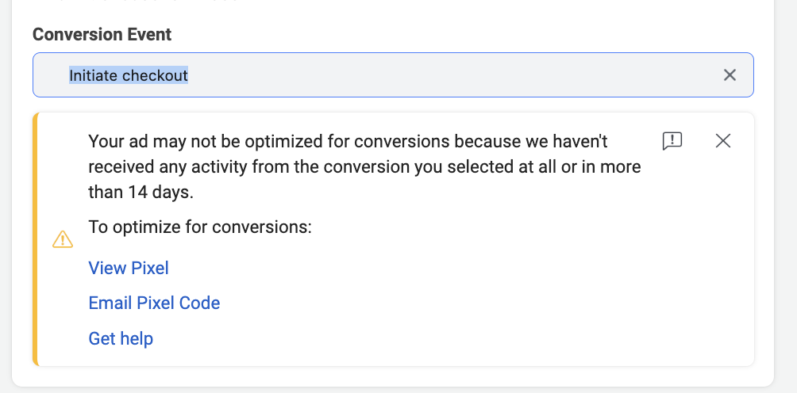

# Targeted ad on FB, with variations: setup

_Below, we give one example from a relevant context, illustrating (with screenshots) what choices you might make, what it would look like, and how to implement it._

_**See also:**_ [facebook-split-testing-etc.md](../../methodological-discussion/splits-randomization/facebook-split-testing-etc.md "mention") and [#videos-facebook](best-practice-guidelines.md#videos-facebook "mention")__

### Getting started

"Meta Business Suite"([https://business.facebook.com/latest/settings/](https://business.facebook.com/latest/settings/)) is the starting point of your ad campaign. If you have a Facebook Business account, you should have a "Meta Business Suite":

 (2).png>)

Next, click on "Ads" (See the megaphone on the left). At this point, you have to link a "Facebook Page" or "Instagram Account" to your ad campaign to have a visible front ground of your business that users could connect with the ad. You can create a new page or manage access to an existing page or Instagram account:

 (1).png>)

The next step is to select "Create Ad", and to choose a goal.

 (1).png>)

### **Budget optimization**

When creating a new "Traffic campaign" ('cold traffic campaign' referenced [HERE](https://www.bigcommerce.com/blog/create-facebook-ad-campaigns/#undefined)) there are a lot of options to help you optimize your delivery while minimizing your expenses.

You need to opt-in to these tools by ticking "create A/B test" and "Budget Optimization" on the first page of your "ad campaign manager." Since there is no downside (we would like to learn which ad design works best), we decide to _opt-in to each of these._

.png>)

Budget optimization is closely related to the choice of the target group. In general, the larger the target group, the cheaper it becomes to reach a certain amount of "link clicks".

### **Targeting the ad**

Suppose we wish to create a targeted ad for a particular Facebook audience. For example, we might wish to put an ad...

* in the 'feed' of US Americans who are interested in charity or volunteering or philosophy
* giving them a link to a page encouraging them to learn about EA

Here, I chose "Get more website Visitors". ... Then "Edit Audience". Below, I chose people in the US over age 18 who are interested in any of a set of things related to charity, volunteering, or philosophy. This is a very broad audience, with about 80 million potential people

.png>)

Facebook estimates that spending $5 per day over 5 days will lead 358-1000 people seeing the ad and 72-208 clicks. That implies a cost of between 12 cents and 34 cents per click

.png>)

We can use the "schedule and duration" function not only to automate the timing of our campaign, but also to estimate its cost. For example, we assume that we need 800 participants to click-through to start the 20 fundraisers (i.e., a rate of 2.5%).

Below, we see that FB estimates 172-497 link clicks per day for 10 Euros per day for (a different\_ case.

 (1).png>)

These numbers seems over-optimistic in general, we've seen figures of $1-2 per click elsewhere. Some potentially reliable figures below (sources "[Wordstream](https://www.wordstream.com/blog/ws/2017/02/28/facebook-advertising-benchmarks)" and re-reporting of Wordstream [here](https://fitsmallbusiness.com/how-much-does-facebook-advertising-cost/))

.png>).png>)\
\
From a recent relevant experience in our group's context...

> The last campaign based on clicks I ran got 461 clicks for $244 USD over 2 weeks with 113k impressions. \[i.e., $0.50 per click]

Note that (maybe obviously) 'clicking on a Facebook ad' is a rare thing for people to do. In the quote above, thats about 4 clicks per 1000 impressions.

#### Narrower targeting

It seems you can target more carefully in the "Ads Manager".

.png>)

If you don't have an existing contact list or comparison group, you may prefer to simply specify characteristics. That is "Create a Saved Audience".\
\
For example, you can specify age groups and then 'detailed targeting' categories, including, e.g., Schools (including universities):

.png>)

You can specify

1. Demographics
2. Interests
3. Behaviors

"Include" seems to be the default when specifying these ... it 'expands the audience'. You can click 'narrow further' to constrain the audience.


Don't forget to use the search tool within 'browse' to find ways to do careful targeting\
 (1) (1).png>) (1).png>)


\
During this process, you can see a concise statement of your choices, and the estimated audience size further up on the page:\
 (1) (1).png>)

#### **How should we (EA, effective giving) target ads?**

We have some evidence that narrower targeting helps. An obvious candidate is

.png>)

### **Traffic choice**

The next big choice is 'where do you want to drive traffic?'. You'll enter more details about the destination later.

Since we want people to click our web app, we chose "website".

 (2) (1).png>)

### **Version testing**

We may have several versions of the ad we want to try out, and we want Facebook to iterate towards the one that is more successful using their algorithm. Ideally, we would like to learn \*\*\*\* as much as we can about 'which ads perform better on which audiences'**.**

We can set up Facebook's ("meta") algorithm to dynamically optimize over which will get the most clicks.

> _DR: However, in some cases if you want an A/B test you can analyze with traditional statistical methods, you might not want this._

"Dynamic Creative" is an option to enhance this process. It takes multiple media (images, videos) and multiple ad components (such as images, videos, text and calls-to-action) and then mixes and matches them in new ways to improve your ad performance.

"Dynamic creative" can be either switched on or off. (Given that we want to optimize over several versions, I see no downside to this feature. Thus, we switch it on.)

.png>)

> Where do we actually specify, enter, and style our ad content?

_Finally, we have to decide which delivery we want to optimize._

We may want the ad that gets the most "~~conversions~~ traffic to our page". Therefore, we choose the option "link clicks".

> DR [Janek Kretschmer](https://app.gitbook.com/u/6WafaQakuhP8Gb7iyAbABpmQQvZ2 "mention") -- what were the other choices? Note 'conversions' usually involves some action _on our page, not just a click-through ... we probably would want to optimize for 'click the final button to finish'_

\
However, we might instead want FB to optimize the ad presentation in terms of which ad not just leads to the most 'clickthroughs' but leads to the most "conversions" or some other action taken on our page\
\
To do that we need to set up a "meta pixel".

> DR [Janek Kretschmer](https://app.gitbook.com/u/6WafaQakuhP8Gb7iyAbABpmQQvZ2 "mention") How do we set up such a pixel? Presumably something in our webpage also needs to integrate this so it knows what the "action on your page", to feed back to Facebook to optimize over.

### **Cost and cost controls**

> DR: In my past experience, you ended up paying Facebook based on the number of "clicks" you got not simply on how long your ad was up. But it's probably a combination of these, and there are probably different pricing plans. You can tell Facebook to put a limit on either of these do not go "over budget". Facebook will aim to spend your entire budget and get the most link clicks using the lowest cost bid strategy.

 (1).png>)

Currently EUR 315 is the max for new users ... but for our present pilot we may want less than this (check: how much do we expect to pay for 800 clicks, let's split this up into ... first 100 clicks, next 300 clicks,.. to see if its going OK )

### **Designing your ad**

Finally, you enter the third and last page of the ad creation process. Here you have to verify your ID and Facebook page and choose the actual design of your ad versions. \["of which the most important one is whether you want to have a video or single image." (?) ]

> DR: [Janek Kretschmer](https://app.gitbook.com/u/6WafaQakuhP8Gb7iyAbABpmQQvZ2 "mention")Can you show how this design process would work?

\
The last step before publication is to specify the destination for your campaign.

 (1).png>)

We chose a website and simply copy the URL into the mask to make sure the ad is linking people to the right destination.

### Payment (and monitoring)

> [Janek Kretschmer](https://app.gitbook.com/u/6WafaQakuhP8Gb7iyAbABpmQQvZ2 "mention")how does the payment work? Are there any other checks we need to go through?
