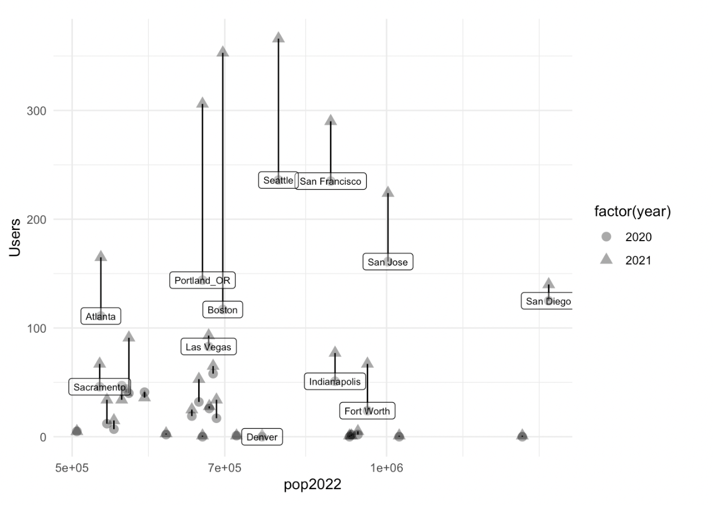

# Targeted ad on FB, with variations: setup

_Below, we give one example from a relevant context, illustrating (with screenshots) what choices you might make, what it would look like, and how to implement it._

_**See also:**_ [facebook-split-testing-etc.md](../../methodological-discussion/splits-randomization/facebook-split-testing-etc.md "mention") and [#videos-facebook](best-practice-guidelines.md#videos-facebook "mention")


**Updates/general advice:** (Sep 2022) **** To do 'any good tracking and optimization through 'Facebook, you should set up the Meta Pixel and Conversion API as soon as possible.

\
You may want to jump to the [#optimizing-and-pixels](targeted-ad-on-fb-with-variations-setup.md#optimizing-and-pixels "mention") (WIP) section.


### Getting started

"Meta Business Suite"([https://business.facebook.com/](https://business.facebook.com/latest/settings/)) is the starting point of your ad campaign. If you have a Facebook Business account, you should have a "Meta Business Suite":

Next, click on "Ads manager" (See the megaphone on the left).&#x20;

Link a page?

You have to link a "Facebook Page" or "Instagram Account" to your ad campaign to have a visible front ground of your business that users could connect with the ad. You can create a new page or manage access to an existing page or Instagram account:

<figure><figcaption></figcaption></figure>

The next step is to select "Create a campaign" and choose an "objective"... the interface gives you some idea of what these aim for:\
\
 (2).png>).png>).png>).png>)

.png>)

### **Budget optimization**

When creating a new "Traffic campaign" ('cold traffic campaign' referenced [HERE](https://www.bigcommerce.com/blog/create-facebook-ad-campaigns/#undefined)) there are a lot of options to help you optimize your delivery while minimizing your expenses.

You need to opt-in to these tools by ticking "create A/B test" and "Budget Optimization" on the first page of your "ad campaign manager." Since there is no downside (we would like to learn which ad design works best), we decide to _opt-in to each of these._

 (1) (1).png>)

Budget optimization is closely related to the choice of the target group. In general, the larger the target group, the cheaper it becomes to reach a certain amount of "link clicks".

### **Targeting the ad**

Suppose we wish to create a targeted ad for a particular Facebook audience. For example, we might wish to put an ad...

* in the 'feed' of US Americans who are interested in charity or volunteering or philosophy
* giving them a link to a page encouraging them to learn about EA

Targeting example

Here, I chose "Get more website Visitors". ... Then "Edit Audience". Below, I chose people in the US over age 18 who are interested in any of a set of things related to charity, volunteering, or philosophy. This is a very broad audience, with about 80 million potential people

\
\

Facebook estimates that spending $5 per day over 5 days will lead 358-1000 people seeing the ad and 72-208 clicks. That implies a cost of between 12 cents and 34 cents per click

Facebook estimates that spending $5 per day over 5 days will lead 358-1000 people seeing the ad and 72-208 clicks. That implies a cost of between 12 cents and 34 cents per click

We can use the "schedule and duration" function not only to automate the timing of our campaign, but also to estimate its cost. For example, we assume that we need 800 participants to click-through to start the 20 fundraisers (i.e., a rate of 2.5%).

Below, we see that FB estimates 172-497 link clicks per day for 10 Euros per day for (a different\_ case.

 (1) (1) (2).png>)

Benchmarking these numbers

These numbers seem over-optimistic in general, we've seen figures of $1-2 per click elsewhere. Some potentially reliable figures below (sources "[Wordstream](https://www.wordstream.com/blog/ws/2017/02/28/facebook-advertising-benchmarks)" and re-reporting of Wordstream [here](https://fitsmallbusiness.com/how-much-does-facebook-advertising-cost/))

 (1) (1).png>) (2).png>)\
\
From a recent relevant experience in our group's context...

The last campaign based on clicks I ran got 461 clicks for $244 USD over 2 weeks with 113k impressions. \[i.e., $0.50 per click]

Note that (maybe obviously) 'clicking on a Facebook ad' is a rare thing for people to do. In the quote above, thats about 4 clicks per 1000 impressions.

Narrower targeting in the 'ads manager'

It seems you can target more carefully in the "Ads Manager".

If you don't have an existing contact list or comparison group, you may prefer to simply specify characteristics. That is "Create a Saved Audience".\
\
For example, you can specify age groups and then 'detailed targeting' categories, including, e.g., Schools (including universities):

\
\
**More detailed targeting**

​Write a caption​You can specify

1. Demographics
2. Interests
3. Behaviors

"Include" seems to be the default when specifying these ... it 'expands the audience'. You can click 'narrow further' to constrain the audience.Don't forget to use the search tool within 'browse' to find ways to do careful targeting ​​​​Exit with⌘↩\

Create a saved audience

 (1) (1).png>)

You can specify

1. Demographics
2. Interests
3. Behaviors

"Include" seems to be the default when specifying these ... it 'expands the audience'. You can click 'narrow further' to constrain the audience.


Don't forget to use the search tool within 'browse' to find ways to do careful targeting\
 (1) (1).png>) (1).png>)


\
During this process, you can see a concise statement of your choices, and the estimated audience size further up on the page:\
 (1) (1) (2).png>)

#### **How should we (EA, effective giving) target ads?**

We have some evidence that narrower targeting helps. An obvious candidate is

 (1) (2) (1).png>)

### **Traffic choice**

The next big choice is 'where do you want to drive traffic?'. You'll enter more details about the destination later.

Since we want people to click our web app, we chose "website".

 (2) (1).png>)

### **Version testing**

We may have several versions of the ad we want to try out, and we want Facebook to iterate towards the one that is more successful using their algorithm. Ideally, we would like to learn as much as we can about 'which ads perform better on which audiences'**.**

We can set up Facebook's ("meta") algorithm to dynamically optimize 'over which will get the most clicks.'

"Dynamic creative"

"Dynamic Creative" is an option to enhance this process. It takes multiple media (images, videos) and multiple ad components (such as images, videos, text and calls-to-action) and then mixes and matches them in new ways to improve your ad performance.

"Dynamic creative" can be either switched on or off. (Given that we want to optimize over several versions, I see no downside to this feature. Thus, we switch it on.)

> Where do we actually specify, enter, and style our ad content?

_Finally, we have to decide which delivery we want to optimize._

We may want the ad that gets the most "~~conversions~~ traffic to our page". Therefore, we choose the option "link clicks".

\
However, we might instead want FB to optimize the ad presentation in terms of which ad not just leads to the most 'clickthroughs' but leads to the most "conversions" or some other action taken on our page\
\
To do that we need to set up a "meta pixel". See [#optimizing-and-pixels](targeted-ad-on-fb-with-variations-setup.md#optimizing-and-pixels "mention")

### **Cost and cost controls**

DR: In my past experience, you ended up paying Facebook based on the number of "clicks" you got not simply on how long your ad was up. But it's probably a combination of these, and there are probably different pricing plans. You can tell Facebook to put a limit on either of these do not go "over budget". Facebook will aim to spend your entire budget and get the most link clicks using the lowest cost bid strategy.

 (1) (1) (1).png>)

Currently EUR 315 is the max for new users ... but for our present pilot we may want less than this (check: how much do we expect to pay for 800 clicks, let's split this up into ... first 100 clicks, next 300 clicks,.. to see if its going OK )

### **Designing your ad**

Finally, you enter the third and last page of the ad creation process. Here you have to verify your ID and Facebook page and choose the actual design of your ad versions. \["of which the most important one is whether you want to have a video or single image." (?) ]

\
The last step before publication is to specify the destination for your campaign.

 (1).png>)

We chose a website and simply copy the URL into the mask to make sure the ad is linking people to the right destination.

### Payment (and monitoring)

## Optimizing and pixels

### Setting up the pixel&#x20;

The pixel includes content from Facebook that needs to be integrated into your website/page of interest. (To do: link instructions for this).&#x20;

### Adding pixel 'events' to your web page

**One simple way of doing this: "Events setup tool"**

Once you are in the ads manager for an ad, go to the 'Events Manager':

\
 (2).png>)

"Add events", choose "from the pixel"

 (2).png>)

"Events setup tool"

 (1).png>)

Put the URL for your site in and 'Open website'

.png>)

\
As seen below, this opens our page, and show what things have already been associated with a Pixel. Here the "create fundraiser" button on this page has been associated with a button on this page with the  "Initiate Checkout". (We use default names Facebook is familiar with, even though there is no 'checkout' in this case).&#x20;

.png>)

("Facebook Pixel Helper" extension in Chromium might be helping here, but I'm not sure how).

"Track new button" lets you see what click options you could associate with a pixel.This highlights clickable things you can do this with. ('Create fundraiser' is not highlighted, probably because it's already been assigned).\
.png>)&#x20;

For example, I could click 'who are we' on a page and associate it with 'view content'

.png>)

I could 'add a value' to this, if it makes sense.&#x20;


_Can I use this later to have FB optimize for 'net value'_ of a user generated on the page? This might be a useful way to assign greater importance to certain things, even if they aren't actually monetized.


After this 'finish setup' ... it gives you the chance to see what you have asked it to do and confirm or cancel it.&#x20;

### Using the pixel events for Facebook ad optimization  &#x20;

Once you have nice pixels set up, you can use this in helping Facebook decide which versions of ads to serve, which audiences to serve them to, etc. You set up your ad, define an objective etc...&#x20;

Define your goal as 'conversion', and define what 'conversion' corresponds to in terms of pixels:\
.png>)

Here we're choosing 'initiate checkout', which we defined as clicking on a  'create fundraiser' button on the first page of our site (early in the funnel)

.png>)

\
The warning below might not matter as we&#x20;


The warning below might not matter as we haven't had our page up for a while. But we have also been told elsewhere that before you can get the ad to optimize for conversions ... \
you first need to have the pixel set up and the ad running, optimizing for views. So this might still be a concern.&#x20;



Facebook tracks people for a while. So in optimizing, you can change 'what time period of  outcomes it attributes to which (version of the ad)':\
.png>) \

I assume that the same 'conversions' target defined above is used in optimizing the 'dynamic creative' if you turn that on.&#x20;

.png>)

